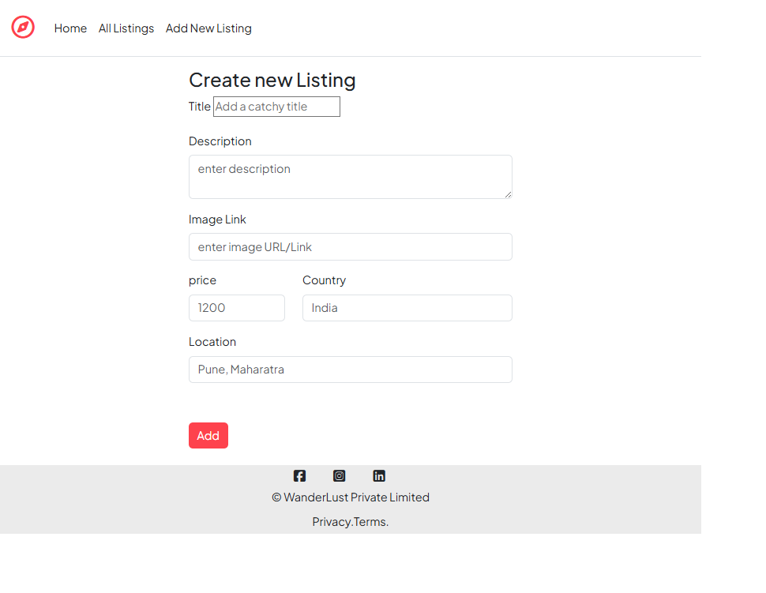
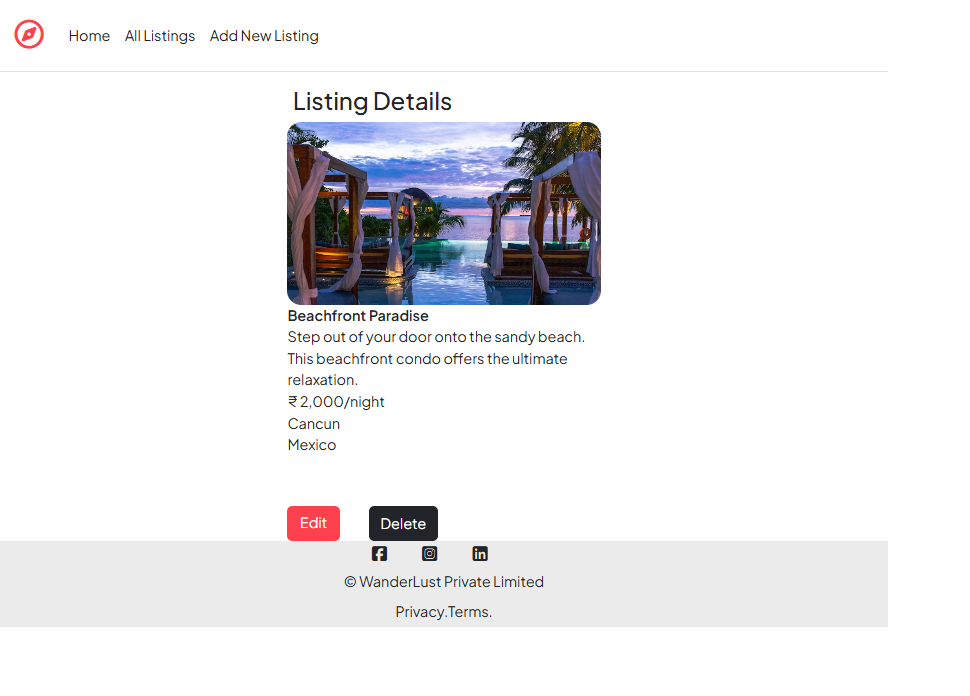

# Wanderlust — Airbnb-style Listing App

A full-stack Airbnb-style listing web application built with Node.js, Express, MongoDB and EJS. Wanderlust lets users create, browse, and book listings with photos and basic management features.

## Table of contents
- [Demo](#demo)
- [Features](#features)
- [Tech stack](#tech-stack)
- [Prerequisites](#prerequisites)
- [Installation](#installation)
- [Environment variables](#environment-variables)
- [Database](#database)
- [Running the app](#running-the-app)
- [Project structure](#project-structure)
- [Deploying to production](#deploying-to-production)
- [Contributing](#contributing)
- [License](#license)
- [Contact](#contact)

## Demo





## Features
- Create, edit and delete property listings
- Upload and display listing photos (adjust instructions depending on your upload provider)
- Browse listings with basic search/filtering
- User authentication and sessions
- Booking or reservation flow (if implemented)
- EJS server-side rendered views

## Tech stack
- Node.js
- Express.js
- MongoDB (Mongoose)
- EJS (templating)
- HTML / CSS / JavaScript for front-end
- (Optional) Cloudinary / Multer for image uploads
- (Optional) express-session / passport or custom auth

## Prerequisites
- Node.js (v16+ recommended)
- npm (or yarn)
- MongoDB instance (local or MongoDB Atlas)
- (Optional) Cloud storage account for images (Cloudinary or S3)

## Installation

1. Clone the repository:
   ```
   git clone https://github.com/Yash-wakchaure/wanderlust-app.git
   cd wanderlust-app
   ```

2. Install dependencies:
   ```
   npm install
   ```

3. Create a `.env` file in the project root and add the environment variables described below.

## Environment variables
Create a `.env` file and add the variables your app needs. Example variables commonly used in this type of project:

```
PORT=3000
NODE_ENV=development
MONGODB_URI=mongodb://localhost:27017/wanderlust
SESSION_SECRET=your_session_secret_here
# If using Cloudinary for image uploads:
CLOUDINARY_CLOUD_NAME=your_cloud_name
CLOUDINARY_API_KEY=your_api_key
CLOUDINARY_API_SECRET=your_api_secret
```

Adjust these names to match what's used by the app code.

## Database
- For development you can run a local MongoDB server.
- To use MongoDB Atlas, create a cluster and set `MONGODB_URI` to the provided connection string.
- If your project includes seeding scripts, run them after the database is connected (see any `scripts/seed` or `seed.js` file).

## Running the app

- Development (with nodemon if configured):
  ```
  npm run dev
  ```
  or
  ```
  node index.js
  npm start
  ```

- Production:
  - Ensure `NODE_ENV=production`
  - Start with a process manager (PM2) or a hosting provider
  - Build assets if you have a bundler / build step

Note: Replace the above commands with the exact npm scripts present in your package.json (`start`, `dev`, etc.).

## Project structure (example)
```
/wanderlust-app
├─ /public            # static assets (css, js, images)
├─ /views             # EJS templates
├─ /routes            # Express routes
├─ /models            # Mongoose models
├─ /controllers       # Route handlers / business logic
├─ /middleware        # Custom middlewares (auth, error handlers)
├─ index.js / app.js  # Application entry
├─ package.json
└─ README.md
```
Adjust this to match your repo's actual structure.

## Deploying to production
- Use a PaaS (Heroku, Render, Fly, Vercel for frontend + separate backend) or a VPS.
- Ensure environment variables are set in the host's configuration.
- Use a managed MongoDB (MongoDB Atlas) or an external database for production.
- Configure HTTPS, CORS and proper session/cookie security settings.

## Contributing
Contributions are welcome. Suggested workflow:
1. Fork the repo
2. Create a feature branch: `git checkout -b feature/my-feature`
3. Commit changes: `git commit -m "Add my feature"`
4. Push and create a pull request

If you have linting, tests or code style requirements, document them here.

## Troubleshooting
- Connection errors: verify `MONGODB_URI` and that MongoDB is running.
- Session/cookie issues: check `SESSION_SECRET` and cookie settings.
- File uploads: check upload provider credentials and allowed file sizes/types.

## License
This project currently has no license specified. Add a LICENSE file if you intend to make the project open source under a particular license (MIT, Apache-2.0, GPL, etc.).

## Contact
Repository: [Yash-wakchaure/wanderlust-app](https://github.com/Yash-wakchaure/wanderlust-app)  
Author: Yash-wakchaure

